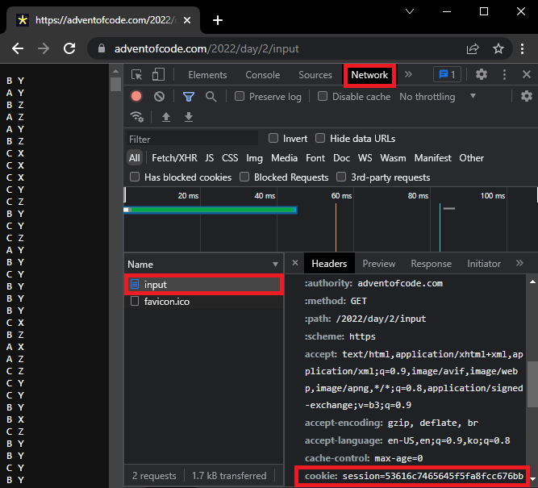

## How to Get Your Session ID

You may obtain your session ID from the input request headers.

1. Visit any previous puzzle's input URL, for example: https://adventofcode.com/2022/day/2/input

2. From your browser, right click and select **Inspect**.

3. Navigate to **Network** and refresh the page. 

4. Select `input` document, and under the **Headers** tab, find the value of **cookie**.

